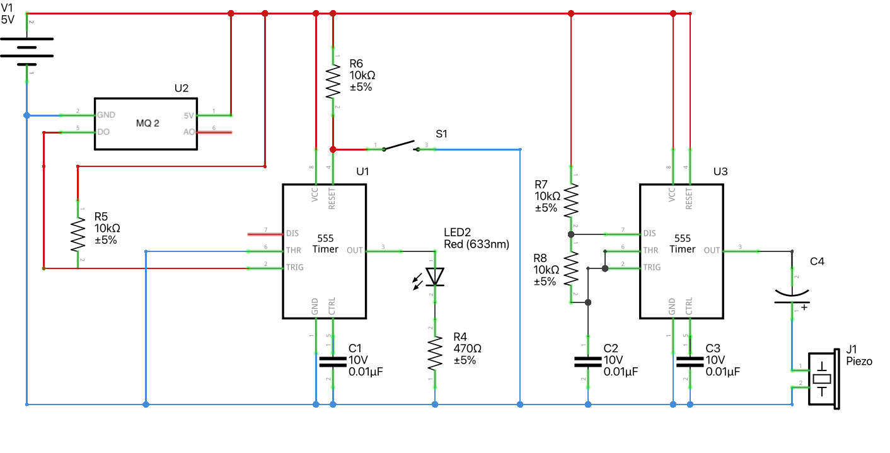

### 555 Timer in Bistable Mode: Manual Control for Critical Circuits! 

In bistable mode, the 555 timer behaves differently from its usual modes. There is no timing component, only two states. 
Press the trigger button, and the LED switches on, staying on indefinitely. Press the reset button, and the LED returns to the off state. 
Pin six is grounded, meaning the output remains in either a high or low state until one of the buttons is pressed. 
It’s ideal for circuits that need manual operation. For instance, a gas sensor could trigger an alarm that stays on until you manually reset it.

**Components:**  
    - 2x[555 Timer IC - NE555P/TLC555](https://amzn.to/4e37ImL)  
    - 1x[MQ-2 gas sensor](https://amzn.to/47DRsq5)  
    - 2x[Capacitor - 0.01µF](https://amzn.to/4ej3CHd)  
    - 2x[Capacitor - 10µF](https://amzn.to/3TyFCaP)  
    - 4x[10kΩ Resistor](https://amzn.to/3MKHkCc)
    - 1x[Resistor - 470Ω](https://amzn.to/3TEBoPa)
    - [5V Power Supply](https://amzn.to/3ZmUHQr)  
    - [Breadboard](https://amzn.to/4e6ldlK)   
    - [Jumper Wires](https://amzn.to/4e39c0j)   
    - [Push Button](https://amzn.to/47pGBjt)
    - [LED Diode](https://amzn.to/3Bfu3Ps)

**How it Works:**

