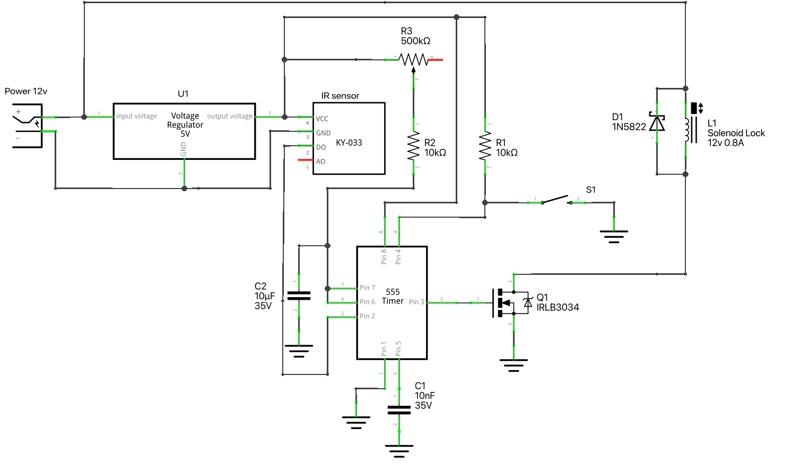

### 555 Timer with Infrared Tracking Sensor and Solenoid Lock Schematic

This schematic demonstrates how to use a 555 timer in monostable mode to control a solenoid lock with the 
help of an infrared tracking sensor and a MOSFET for signal amplification. 

The 555 timer is triggered by the infrared sensor, 
and the output pulse is used to drive the solenoid lock through the MOSFET.

Adjusting the trimmer resistor allows you to control the duration of the pulse, which in turn controls how long the solenoid remains activated.

**Components:**  
    - [555 Timer IC - NE555P/TLC555](https://amzn.to/4e37ImL)  
    - [Infrared Tracking Sensor - TCRT5000](https://amzn.to/3z9Z9aN)  
    - [N-channel MOSFET- IRLB3034](https://amzn.to/4e5gqkt)  
    - [Solenoid Lock - 12v](https://amzn.to/3XtjzDt)  
    - [Flyback Diode - 1N5822](https://amzn.to/4ejsLRG)  
    - [Capacitor - 1µF](https://amzn.to/3TyFCaP)  
    - [Capacitor - 10µF](https://amzn.to/3TyFCaP)  
    - [2 x 10kΩ Resistor](https://amzn.to/3MKHkCc)  
    - [Adjustable Trimmer Resistor](https://amzn.to/3MIN2oh) for pulse duration control  
    - [Voltage regulator](https://amzn.to/3XFPB0t)  
    - [12V Power Supply](https://amzn.to/3ZmUHQr)  
    - [Breadboard](https://amzn.to/4e6ldlK)   
    - [Jumper Wires](https://amzn.to/4e39c0j)   
    - [Push Button](https://amzn.to/47pGBjt) (optional, for resetting the timmer)  

**Power Supply Configuration:**
- The solenoid lock is powered by a 12V supply.
- **Voltage Regulator**: Provides a stable 5V supply for the infrared sensor and the 555 timer.

**How it Works:**

