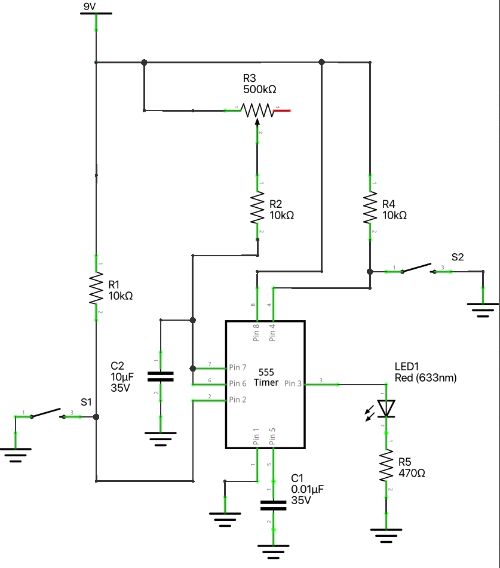

### 555 Timer in monostable mode with controllable pulse length.

This schematic demonstrates how to use a 555 timer in monostable mode to control a LED diode. 
The pulse length can be adjusted by rotating the trimmer resistor or by changing the value of 
the capacitor and resistor connected to the 555 timer.

**Components:**  
    - [555 Timer IC - NE555P](https://amzn.to/4e37ImL)  
    - [Capacitor - 1µF](https://amzn.to/3TyFCaP)  
    - [Capacitor - 10µF](https://amzn.to/3TyFCaP)  
    - [3 x 10kΩ Resistor](https://amzn.to/3MKHkCc)
    - [Resistor - 470Ω](https://amzn.to/3znlYI3)  
    - [Adjustable Trimmer Resistor](https://amzn.to/3MIN2oh)  
    - [Breadboard](https://amzn.to/4e6ldlK)   
    - [Jumper Wires](https://amzn.to/4e39c0j)   
    - [2 x Push Button](https://amzn.to/47pGBjt)
    - [LED Diode](https://amzn.to/3TyJwjZ)
   

**How it Works:**

